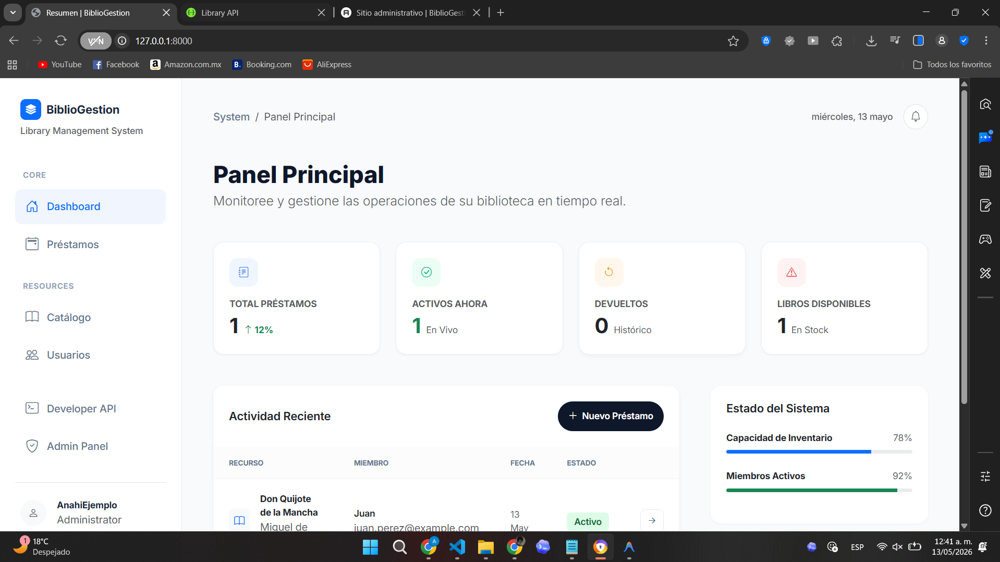
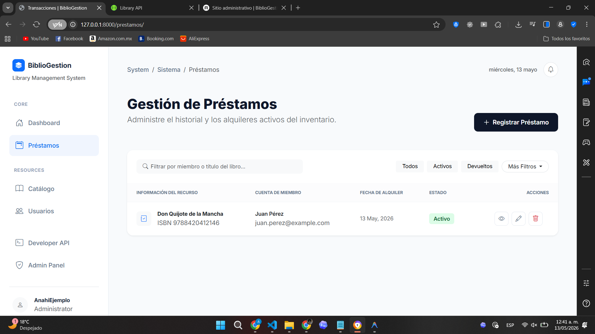
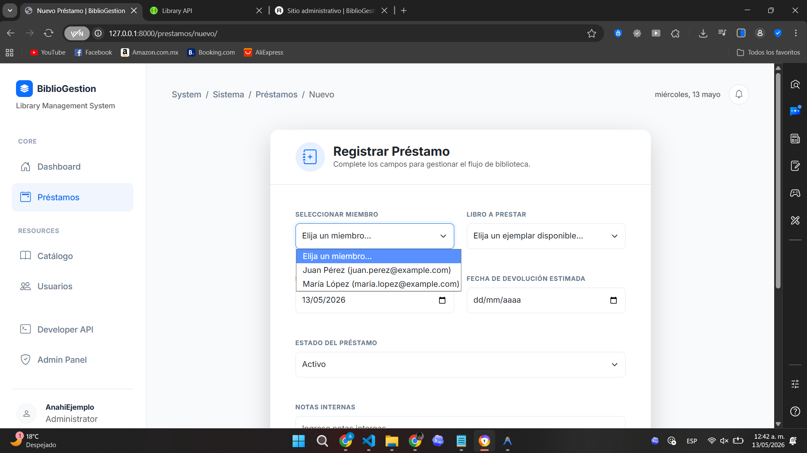
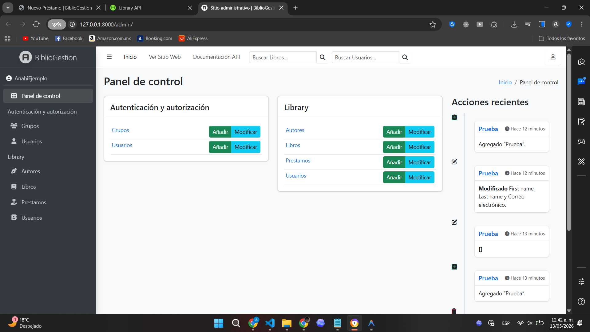
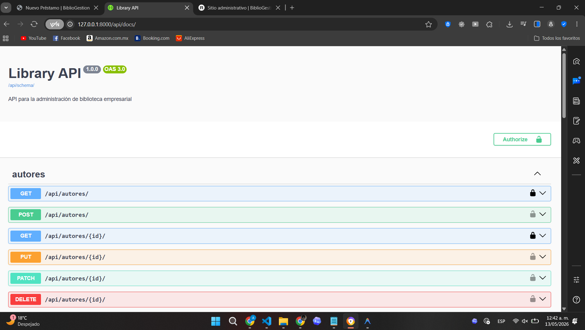

# BiblioGestion - Sistema de Administración de Biblioteca

BiblioGestion es un sistema de administración de biblioteca desarrollado con Django y Django REST Framework. 

El proyecto permite gestionar autores, usuarios, libros y préstamos, además de exponer una API REST documentada y un panel administrativo personalizado.

---

## Screenshots

### Dashboard


### Préstamos


### Crear préstamo


### Admin


### Swagger


---

## Tecnologías utilizadas

*   **Python 3**
*   **Django**
*   **Django REST Framework**
*   **SQLite**
*   **Bootstrap 5**
*   **Jazzmin**
*   **drf-spectacular**
*   **django-import-export**

---

## Instalación y ejecución

Siga estos pasos para configurar el sistema localmente:

### 1. Clonar el repositorio
```bash
git clone <URL_DEL_REPOSITORIO>
cd Djando-biblioteca
```

### 2. Crear y activar entorno virtual

**Windows PowerShell:**
```powershell
python -m venv venv
.\venv\Scripts\activate
```

**Linux / macOS:**
```bash
python3 -m venv venv
source venv/bin/activate
```

### 3. Instalar dependencias
*Nota: Si no utiliza un entorno virtual, ejecute el comando directamente en la raíz del proyecto.*
```bash
pip install -r requirements.txt
```

### 4. Aplicar migraciones
```bash
python manage.py migrate
```

### 5. Crear superusuario
```bash
python manage.py createsuperuser
```
*Este usuario permite acceder al Panel de Administración de Django.*

### 6. Ejecutar servidor
```bash
python manage.py runserver
```

### 7. Acceso al sistema
URL principal: [http://127.0.0.1:8000/](http://127.0.0.1:8000/)

---

## Ejecutar pruebas

```bash
python manage.py test
```

---

## Rutas principales

| Sección | URL |
| :--- | :--- |
| **Dashboard** | http://127.0.0.1:8000/ |
| **Préstamos** | http://127.0.0.1:8000/prestamos/ |
| **Admin** | http://127.0.0.1:8000/admin/ |
| **Swagger/OpenAPI** | http://127.0.0.1:8000/api/docs/ |
| **Schema** | http://127.0.0.1:8000/api/schema/ |

---

## API REST

Endpoints:
*   `/api/autores/`
*   `/api/usuarios/`
*   `/api/libros/`
*   `/api/prestamos/`

---

## Validaciones implementadas

*   **Préstamos activos:** No permite préstamos activos duplicados para el mismo libro.
*   **Stock:** Sincroniza la disponibilidad del libro con el estado del préstamo.
*   **ISBN:** Valida ISBN único en el catálogo.
*   **Email:** Valida email único por usuario.
*   **Disponibilidad:** Bloquea la creación de préstamos sobre libros no disponibles.

---

## Extras implementados

*   **Admin personalizado con Jazzmin:** Interfaz administrativa mejorada.
*   **Filtros y búsquedas en Admin:** Herramientas para gestión eficiente de datos.
*   **Import/Export desde Admin:** Soporte para carga y descarga masiva de registros.
*   **Roles y permisos:** Control básico de acceso al sistema.
*   **Autenticación API:** Soporte para Session y Basic Authentication.
*   **Documentación automática:** Integración con Swagger/OpenAPI.

---

## Estructura del proyecto

```text
├── config/             # Configuración del proyecto
├── library/            # Aplicación principal
│   ├── admin.py        # Configuración de Admin
│   ├── models.py       # Modelos y lógica de negocio
│   ├── templates/      # Vistas web
│   └── views.py        # Controladores Web y API
├── run_local.py        # Script de arranque alternativo
├── run_tests.py        # Script de ejecución de pruebas detallado
└── requirements.txt    # Dependencias
```
